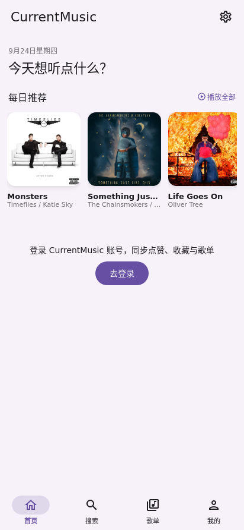
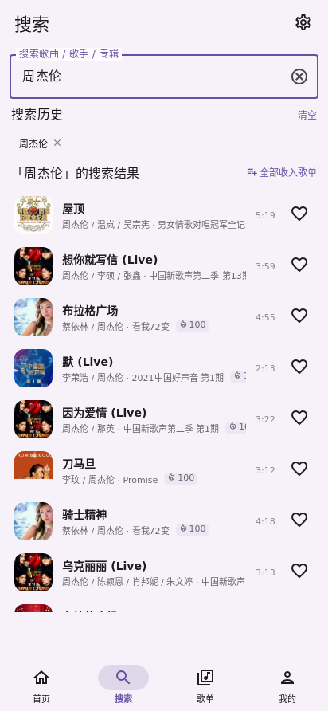
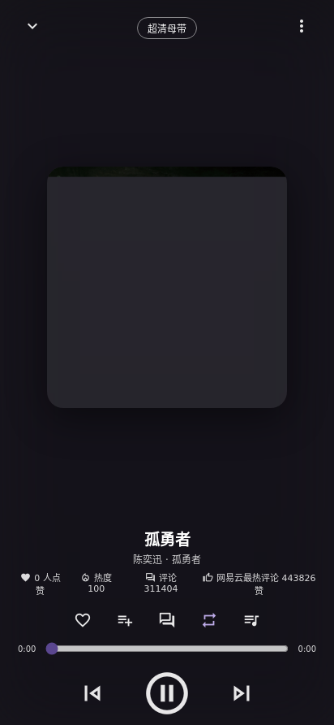
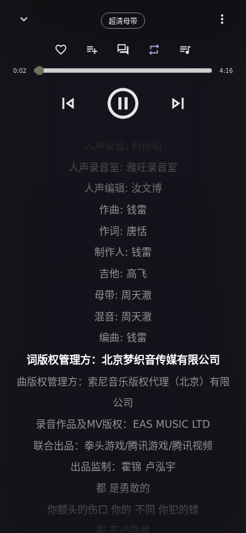
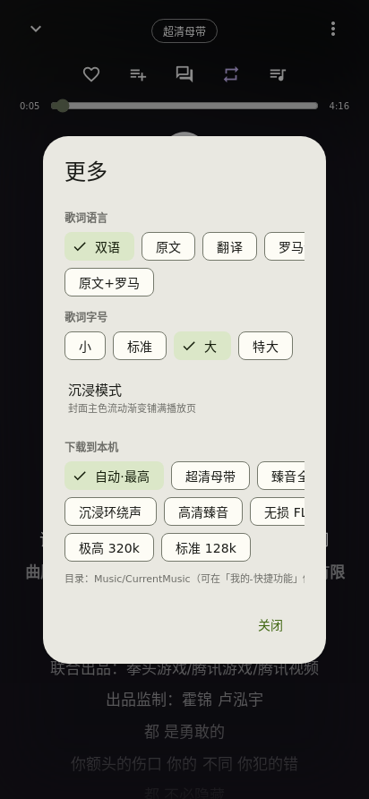
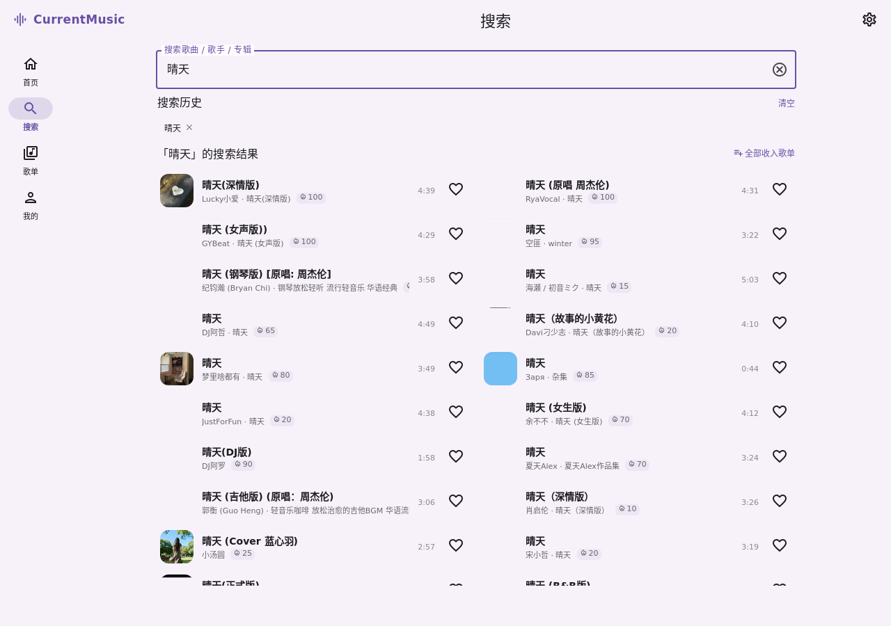

# CurrentMusic

**Material Design 3 风格的 Android 音乐应用 —— 匿名打开即播超清母带级音质。**

> 本仓库开源 **前端壳**（原生 Java WebView 容器 + MDUI 2 Web 前端全部源码）；[Releases](../../releases) 分发的 APK 是**完整版体验**：默认连接作者自建的网易云 SVIP 音源服务，无需任何会员身份即可播放官方需 SVIP 的最高音质。


<p align="center">
  
  
  
  
</p>
<p align="center">
  
  
  
</p>

---

## ✨ 免费听 SVIP 音质

网易云的黑胶 SVIP 音质（无损 / Hi-Res / 超清母带）在官方 App 需要付费会员。本 App 通过**服务端音源代理**实现免费播放：所有取流请求由服务端读取已登录的 SVIP 账号凭据转发，客户端不需要任何会员身份。

同一首歌（《孤勇者》）实测全档位，**匿名访问**即可取到最高档：

| 档位 | 格式 | 码率 | 体积 | 官方要求 |
|---|---|--:|--:|---|
| 标准 | mp3 | 128 kbps | 3.9 MB | 免费 |
| 极高 | mp3 | 320 kbps | 9.8 MB | 免费 |
| 无损 | flac | 908 kbps | 27.7 MB | 黑胶 VIP |
| Hi-Res 高清臻音 | flac | 1,677 kbps | 51.2 MB | SVIP |
| 沉浸环绕声 | flac | 2,056 kbps | 62.7 MB | SVIP |
| 臻音全景声 | flac | 2,879 kbps | 87.9 MB | SVIP |
| **超清母带** | flac | **5,085 kbps** | **155.2 MB** | SVIP · 默认档位即此 |

- 默认「**自动最高**」：服务端并行探测母带 / 全景声 / 环绕声 / 无损四档，按码率择优返回，实测命中超清母带
- 播放页可随时切档，并**按所选档位下载**到本地（系统通知进度 + 自定义目录）
- 服务端只缓存"档位名"，不缓存带时效签名的音频直链（链接 20 分钟过期）

## 🎧 能力分级

| 能力 | 匿名 | 登录后 |
|---|:--:|:--:|
| 搜索 / 歌曲详情 / 榜单歌单 | ✅ | ✅ |
| **全档位取流（含 SVIP 母带）** | ✅ | ✅ |
| 歌词（翻译 + 罗马音）/ 评论区浏览 | ✅ | ✅ |
| 每日推荐 30 首 | ✅ | ✅ |
| 站内点赞（全站计数）与自建歌单 | — | ✅ |
| **手机号验证注册**（短信验证码，注册后手机号可直接登录） | — | ✅ |
| 猜你喜欢（基于点赞歌手） | — | ✅ |
| **绑定自己的网易云账号**（手机验证码 / 扫码）：全量歌单同步（实测 31 张 / 3791 首）、发评论、点赞回复、红心歌曲 | — | ✅ |

## 🧩 功能一览

- **播放**：队列管理 · 四模式合一（列表循环 / 单曲循环 / 顺序 / 随机）· 当前播放列表弹层 · MediaSession · **后台保活**（前台服务 + 唤醒锁）
- **歌词**：LRC / YRC / 混合格式逐行解析 · 双语 / 原文 / 翻译 / 罗马音 / 原文+罗马 五模式 · 字号四档 · 当前句恒居中 · 点句跳播
- **账号**：自建注册——**手机号短信验证**（默认）或邮箱验证码 · 手机号可直接作账号登录 · 内部账户渠道 · 多账号本地切换
- **歌单**：网易云绑定（手机验证码 / 扫码）· 全量自动同步（4 并发 + 时间预算幂等续传）· 正序 / 倒序 / 歌名 / 歌手排序
- **评论区**：热门 / 最新 / 楼层回复 · 点赞、回复、删除自己的评论
- **听歌房**：多人实时「一起听」（支持百人以上）· 房间广场 / 房间号搜索 / 密码房间 · 房主·管理员·房员三级权限 · 点歌审批与自由模式 · 权威时间轴同步（SSE + 时钟偏移估计 + 漂移纠正）
- **个性化**：**动态取色**（全局主色随封面自动变化）· 6 套预设配色 · **沉浸模式**（封面主色流动渐变）· 深浅主题
- **体验**：全控件 MD3 涟漪 · 骨架屏 · 方向感知转场动画 · 原生 insets 桥（全面屏 / 平板沉浸式）· Pad 导航栏 + 双列列表
- **在线更新**：启动自动检测新版本并弹窗提示 · **服务器直连 / GitHub Releases 双下载源**（默认服务器直连，可手动切换）· 应用内下载进度 · 完成后自动拉起系统安装器

## 📦 安装

1. 到 [Releases](../../releases) 下载 `CurrentMusic-*.apk`（自签名，首次安装需允许「未知来源」）
2. 打开即用——默认已连作者服务器，可直接体验全部音质档位
3. 如需使用**自己部署**的后端：App 内「设置 → 服务器地址」填写你的地址

## 🏗 架构

```
┌────────────────────────────────────┐
│ Android 壳（纯 Java，无 androidx）   │  app/        ← 本仓库开源
│  · assets → 伪源 https://cm.local   │
│  · NativeApi HTTP 桥（绕开 CORS）    │
│  · insets / 沉浸式 / 前台保活 / 下载   │
│  └ MDUI 2 SPA（esbuild 单包）        │  web/        ← 本仓库开源
└──────────────┬─────────────────────┘
               │ REST + Bearer token
┌──────────────▼─────────────────────┐
│ CurrentMusic 后端（账号 / 点赞 /     │  ← 不在本仓库
│ 歌单 / 评论 + NCM 音源代理）          │
└──────────────┬─────────────────────┘
               │
    NeteaseCloudMusicApi（SVIP 凭据）   ← 见下方「音源与合规」
```

`web/src` 是完全独立的 SPA，也可直接托管为网页版；接口为 REST + JSON，任何实现同协议的部署都能被 App 接管。

## 🔨 构建

无需 Gradle / AndroidX —— `build.sh` 直接走 aapt2 → javac → d8 → zipalign → apksigner，约 15 秒出包：

```bash
# 依赖：JDK 17 + Android SDK（platform-34 / build-tools 34.0.0）+ Node
cd web && npm install && cd ..
./build.sh                              # → dist/CurrentMusic-1.8.0.apk（约 320 KB）
VER_NAME=1.8.1 VER_CODE=21 ./build.sh   # 自定义版本号
```

## 🎵 音源与合规

音源基于开源项目 **NeteaseCloudMusicApi** 自建部署：

- **API 仓库：https://github.com/Binaryify/NeteaseCloudMusicApi**
- 本部署使用同源增强分支（[NeteaseCloudMusicApiEnhanced](https://github.com/neteasecloudmusicapi-enhanced)），并由作者维护 SVIP 账号凭据与 API 反代

> ⚠️ 音源能力来自上游账号与第三方 API，**仅供个人学习研究**。请勿用于商业用途或大规模分发，相关服务条款与政策风险由使用者自行承担。你可以随时在设置中切换到自己的后端，完全脱离作者服务器。

## ⚠️ 已知限制

- 少数曲目受版权 / 地区限制不可播放（实测周杰伦等此前受限曲目**现已可播**，但不保证长期）
- 无桌面歌词、MV 播放、本地音乐扫描
- 自签名 APK，部分机型需手动允许安装

## 📄 License

[MIT](./LICENSE)
