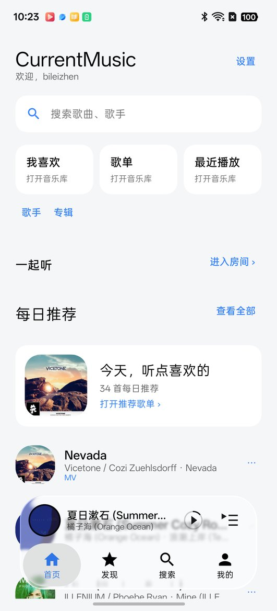
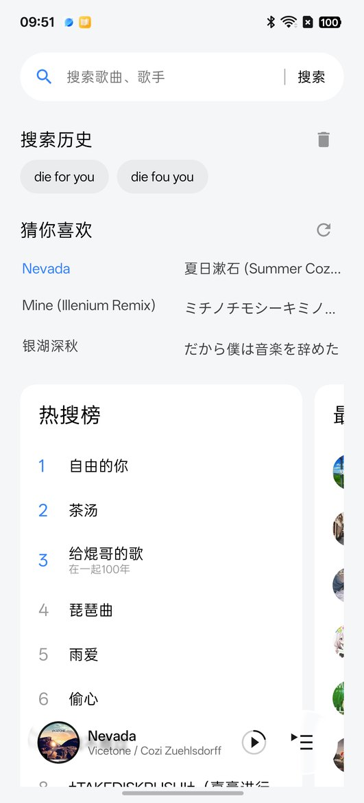
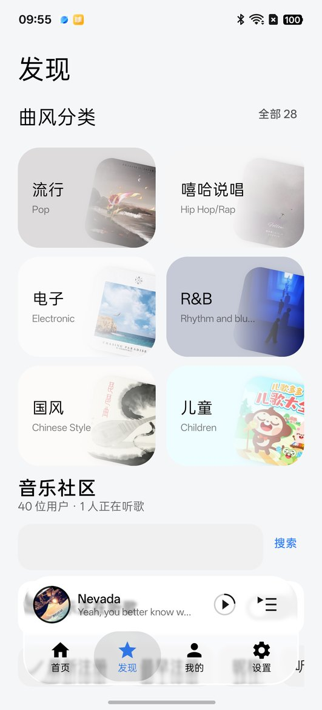

<p align="center">
  
</p>

<h1 align="center">CurrentMusicX</h1>

<p align="center">让封面、歌词和音乐一起流动的原生 Android 播放器</p>

<p align="center">
  <a href="https://github.com/bileizhen/CurrentMusicX/releases/latest"></a>
  <a href="https://github.com/bileizhen/CurrentMusicX/releases"></a>
  
  <a href="LICENSE"></a>
</p>

<p align="center">
  <a href="https://github.com/bileizhen/CurrentMusicX/releases/latest">下载应用</a> ·
  <a href="#功能一览">功能一览</a> ·
  <a href="#界面预览">界面预览</a> ·
  <a href="https://github.com/bileizhen/CurrentMusicX/issues">反馈问题</a> ·
  <a href="CHANGELOG.md">更新记录</a>
</p>

CurrentMusicX 是 [CurrentMusic](https://github.com/backrooms-yrc/CurrentMusic) 的原生 Android 客户端，使用 Kotlin、Jetpack Compose 和 Miuix 构建。围绕日常听歌，提供圆形封面、流动背景、逐字歌词、歌单、网易云账号绑定与一起听，并适配手机和横屏布局。

## 安装与开始使用

1. 在 [最新正式版](https://github.com/bileizhen/CurrentMusicX/releases/latest) 下载 `CurrentMusic-Android-v*.apk`，按系统提示允许安装。
2. 登录 CurrentMusic 账号，在首页搜索歌曲，或打开每日推荐、歌单和最近播放。
3. 需要使用网易云收藏时，在账号页面完成绑定，可选择扫码或手机验证码登录。
4. 在绑定页选择是否开启 **网易云作为主音乐库**：开启后直接使用网易云我喜欢和本人歌单，关闭后使用 CurrentMusic 音乐库。

已安装官方版本可在设置中检查更新，也可使用启动时自动检查。正式版与测试版渠道可选；更新默认通过 CurrentMusic 专用镜像下载，失败时切换备用源，安装前校验文件和签名。

服务器可以在 **设置 → 网络与播放** 中修改；默认地址为 `https://music.20110208.xyz/cm`。音质、歌曲可用性和歌词数据取决于所选音源、服务器及账号权限。

## 功能一览

| 功能 | 使用体验 |
| --- | --- |
| 播放与队列 | 圆形封面、封面氛围背景、进度调节、列表循环／单曲循环／随机／心动模式，支持播放队列管理 |
| 歌词 | 逐字与逐行高亮、翻译和罗马音，支持 LRC、YRC 与 TTML，可调整字体、字号、粗细及歌词偏移 |
| 手势与横屏 | 迷你播放器与播放页联动，拖拽展开／收起；左右切换封面与歌词，横屏切换歌词与控制栏 |
| 歌单 | 封面网格与取色头部，歌单内搜索、排序、随机和继续播放；后台刷新保留内容与滚动位置 |
| 网易云收藏 | 可将网易云设为主音乐库；播放页短按红心喜欢／取消喜欢，长按选择其他可收录歌单 |
| 搜索与发现 | 歌曲、歌手、专辑分类搜索，搜索历史、热搜、音乐风格分类、艺人主页与 MV |
| 歌曲下载 | 音质与保存目录可选，后台进度、取消及重试；写入歌曲信息、封面与歌词，并保存配套 LRC 与封面 |
| 一起听 | 与 CurrentMusic 听友同步播放，支持房间、点歌审批、成员权限和断线恢复 |
| DLNA 投屏 | 发现同一局域网内的兼容设备，投屏播放与控制 |
| 定时与存储 | 定时关闭，可延长到当前歌曲播完；音频缓存、下一首预加载和分项存储清理 |
| 账号与外观 | 多账号切换、个人资料和头像框、听歌统计，明暗主题、动态颜色与可选玻璃效果 |

### 网易云主音乐库

绑定后无需将收藏复制成 CurrentMusic 歌单。开启主音乐库时：

- **我的 → 我喜欢** 直接打开网易云我喜欢的音乐。
- 播放页短按红心直接操作网易云喜欢状态。
- 长按红心可选择自己的其他网易云歌单及 CurrentMusic 可编辑歌单。
- 开关可随时关闭，已有 CurrentMusic 音乐库数据会保留。

### 下载与歌词

支持 MP3、FLAC、M4A、Vorbis OGG、WAV 和裸 AAC 的歌曲下载；裸 AAC 无损封装为 M4A。歌曲信息、封面与歌词直接写入音频文件，保留逐字时间和翻译，方便在其他播放器中使用。内嵌信息的显示效果取决于文件格式与播放器支持。

## 界面预览

<p align="center">
  
  
  
</p>
<p align="center">
  
  
</p>

## 系统支持

- **Android 8.0 及以上**。
- Android 13 及以上可启用实时模糊；低版本或关闭模糊时使用普通材质。
- Android 12 及以上可使用 Monet 动态颜色。
- 支持横屏布局、宽屏导航及系统预测返回。

## 从源码构建

需要 JDK 17 及以上、Android SDK Platform 37.0 和 Android Build Tools 35 及以上。配置 `ANDROID_HOME` 或根目录 `local.properties` 中的 `sdk.dir` 后运行：

```bash
git clone https://github.com/bileizhen/CurrentMusicX.git
cd CurrentMusicX
./gradlew assembleDebug testDebugUnitTest lintDebug
```

Windows 使用 `gradlew.bat`。如果项目路径包含中文，可先使用 `subst` 映射到盘符后构建。调试安装包位于 `app/build/outputs/apk/debug/`。

正式构建使用 `assembleRelease`，签名配置从未入库的 `keystore.properties` 读取。自行构建的调试包与官方包签名不同，不能直接覆盖官方安装包；私钥、密码和镜像凭据请保存在本地。

## 反馈与贡献

欢迎通过 [Issues](https://github.com/bileizhen/CurrentMusicX/issues) 反馈问题或提出建议。描述问题时请附上应用版本、手机型号、Android 版本和复现步骤；截图或诊断日志可以帮助定位问题，请先移除个人信息。

源码在本仓库的 `main` 分支，同步维护于 [CurrentMusic 的 app 分支](https://github.com/backrooms-yrc/CurrentMusic/tree/app)。欢迎提交 Pull Request 改进体验或修复问题。

## 隐私与许可

- [隐私说明](PRIVACY.md)
- [GPL-3.0-only 开源协议](LICENSE)
- [第三方开源项目及许可](THIRD_PARTY_NOTICES.md)

## 致谢

感谢 [CurrentMusic](https://github.com/backrooms-yrc/CurrentMusic)、[Miuix](https://github.com/miuix-kotlin-multiplatform/miuix)、[AMLL TTML DB](https://github.com/amll-dev/amll-ttml-db)、Jetpack Compose、Media3、Coil 和其他开源项目；完整署名与许可见第三方声明。
