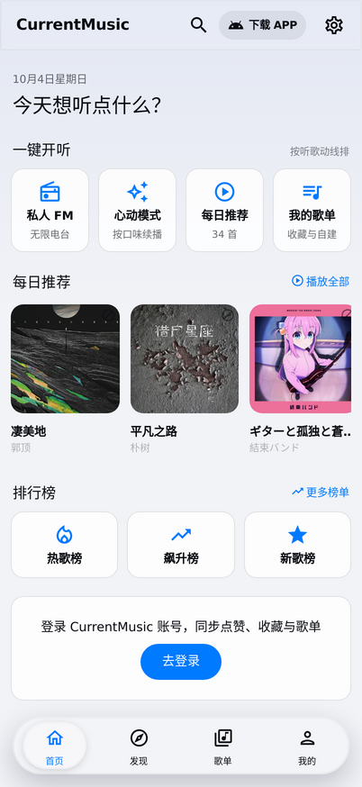
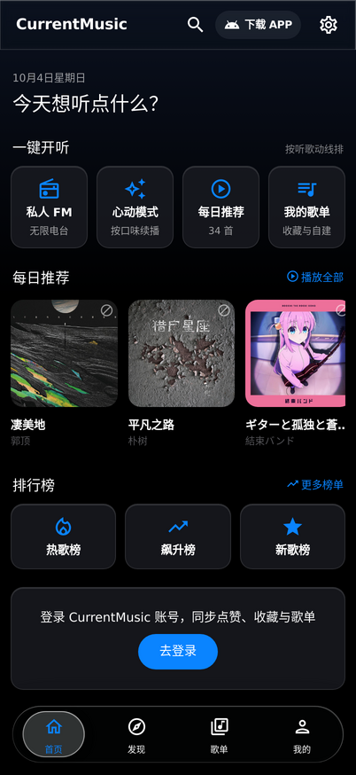
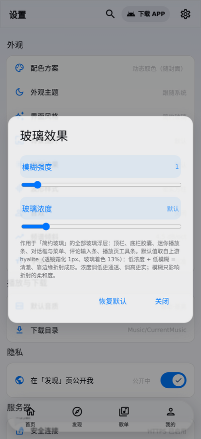
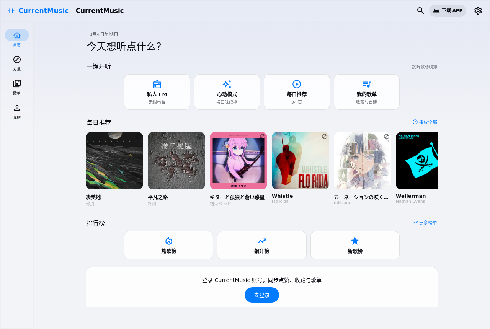

# CurrentMusic

> 基于网易云音乐 SVIP 音源、自建账号体系的 Android 音乐应用。界面走 MDUI 2 / Material Design 3，
> 前端是一份原生 JavaScript 单页应用（无框架），由 Java WebView 壳承载；本仓库同时包含后端服务与运维脚本。

   

**目录**：[界面](#界面) · [功能清单](#功能清单) · [音质档位](#音质档位) · [架构](#架构) · [构建](#构建) · [安装](#安装) · [API 概览](#api-概览) · [部署布局](#部署布局本机已部署) · [已知限制](#已知限制) · [更新日志](#更新日志)

## 界面

默认皮肤「简约玻璃」（Apple Liquid Glass / iOS 26 的做法）：玻璃只用**浮层**，内容卡片保持实体磨砂白——
Apple 的 Liquid Glass 同样只用于 chrome。每块浮层按自己的真实尺寸生成折射位移图（背景是被"掰弯"，
不是糊一层），边缘高光是上游 [hyalite](https://github.com/VII-Cae/hyalite--liquid-glass) `edgeShadow()` 的原式；
底栏选中项另有一颗会流动、可按住拖动的玻璃「水滴」。

<p align="center">
  
  
  
</p>
<p align="center">浅色 · 深色 · 玻璃效果（模糊 1px / 浓度 13% —— 上游 hyalite 的默认值）</p>

宽屏（≥900px）时底栏变左侧竖栏，与顶栏、迷你播放条同一套玻璃配方：

<p align="center"></p>

> 截图来自 Chromium 131 headless（402×874 @2x 与 1280×860）；真机观感以实机为准。

## 架构

```
┌───────────────────────────────┐
│  Android App（Java WebView 壳） │  app/          · 无 androidx、无 Gradle
│  ┌─────────────────────────┐  │
│  │ MDUI 2 SPA（assets/www） │  │  web/src       · vanilla JS + esbuild 单包
│  │ NativeApi HTTP 桥（无CORS）│  │
│  └─────────────────────────┘  │
└──────────────┬────────────────┘
               │ HTTP + Bearer token
┌──────────────▼────────────────┐
│ cm-server（127.0.0.1:3010）    │  backend/      · python3 纯标准库 + sqlite3
│ 自建账号/点赞/收藏/歌单/历史     │               · systemd: currentmusic.service
│ NCM 音源代理（读 SVIP cookie）  │
└──────────────┬────────────────┘
               │ 127.0.0.1:3001 (api-enhanced)
┌──────────────▼────────────────┐
│ 公网入口 music.20110208.xyz/cm/ │               · nginx location /cm/
└───────────────────────────────┘
```

### 关键设计

- **SVIP 音质人人可得**：取歌请求全部由后端代理，服务端读 `/opt/ncm-api/.ncm-cookie` 注入黑胶 SVIP——实测孤勇者 `auto` 档命中**超清母带 5085kbps FLAC**（首次并行探测 8s，档位缓存后 0.02s）。
- **自动最高音质**：`/ncm/song/url?level=auto` 后端并行探测 jymaster/jyeffect/sky/lossless，按码率择优，档位结果缓存 7 天（CDN URL 本身 20 分钟过期，只缓存档位名）。也可固定 7 档任一档。
- **为什么用原生 HTTP 桥**：NCM API 无任何 CORS 头，WebView 页面无法 fetch；桥内 `HttpURLConnection` 线程池执行 + `__cmHttpDone` 回调，读超时 75s 兼容冷查询。
- **为什么壳内用 https://cm.local 伪源**：`shouldInterceptRequest` 把 assets 映射到伪 https 域，ES 模块/字体/localStorage 全部正常，彻底绕开 file:// 的 CORS 陷阱。
- **玻璃效果的对标值有出处**：折射（Liquid Glass）实现参照 [VII-Cae/hyalite--liquid-glass](https://github.com/VII-Cae/hyalite--liquid-glass)（v0.5.0，MIT），**默认值直接取它文档里的值**——透镜霜化 `1px`（`DEFAULTS.blur`）、玻璃着色 `13%`（README 示例 `rgba(0,0,0,.13)`）、无折射内核兜底 `blur(6px)`、边缘高光 `edgeShadow()`（edge `.32` / light `−140°`）；底栏选中「水滴」的填充/描边不透明度取 [mikonyaa/LiquidGlassTabBars](https://github.com/mikonyaa/LiquidGlassTabBars) 的 `selectedFillOpacity .18` / `selectedBorderOpacity .48`。玻璃只用在**浮层**（顶栏/底栏/迷你条/弹窗/菜单/评论输入条/播放页工具条），内容卡片保持实体磨砂白。
- **歌词归一化**：NCM 逐字歌词有两种形态（JSON 元数据行 + `[行起始,时长](字起始,字时长,0)字` 文本正文），后端统一解析为 `{t, txt, trans}[]` 并合并翻译，缓存 7 天。

## 功能清单

| 功能 | 说明 |
|---|---|
| 播放 | 队列/上一首下一首/列表循环/单曲循环/随机/拖动进度/MediaSession |
| 音质 | 自动最高（默认）+ 7 档手动：超清母带/臻音全景声/沉浸环绕声/高清臻音/无损/极高/标准 |
| 音效与均衡器 | 音效开关（杜比全景声/臻音全景声/沉浸环绕声/高清臻音）；五段均衡器（八种预设+自定义） |
| MV / 百科 | 歌曲条「播放 MV」按钮（仅该曲有 MV 时显示，全屏播放，播放时自动暂停音乐）；播放页「更多 → 歌曲百科」查看创作信息/基本信息/百科正文 |
| 搜索 | 回车触发（逐字输入不发请求）、封面/专辑/热度/点赞数展示、历史记录 |
| 点赞 | 云端红心，全站计数「♥ N 人点赞」实时显示 |
| 收藏 | 私人收藏夹（与点赞独立） |
| 歌单 | 创建/重命名/删除/批量增删歌曲/整单播放 |
| 听歌房 | 多人实时「一起听」（百人以上）：房间广场/房间号搜索/密码房间，房主·管理员·房员三级权限，点歌审批或自由模式，权威时间轴同步（SSE + 时钟偏移估计 + 漂移纠正） |
| **网易云绑定** | **手机验证码**（默认）或扫码授权绑定，一键同步网易云 APP 全部歌单（含「我喜欢的音乐」与收藏的歌单）；同步歌单带网易云徽标、只读（改名/删除/加歌只在本地歌单）；解绑保留快照；cookie 失效自动提示重新绑定 |
| 账号 | 自建注册登录（pbkdf2 加盐 + token），**注册验证二选一：手机号短信验证（默认）/ 邮箱验证**；**手机号可作账号登录**；昵称/简介/头像上传、改密码、多账号本地切换 |
| 用户主页 | 统计（点赞/收藏/歌单/听歌天数/**听歌时长**）+ 公开歌单 |
| **头像挂件** | 累计听歌时长 ≥2 小时可设置（402 款 + **名称/ID 搜索**，未达标显示还差多久）；设置后个人主页/发现页/听歌房**全局公开显示**；逐款实测留白补偿使圆环恰好包裹头像；首页横幅直达设置（设好后自动消失） |
| **界面风格** | 设置 → 外观 → 界面风格，可在「默认（Material 3）」、「简约玻璃」（A+B 融合：**全部浮层**走 Apple Liquid Glass——顶栏/底栏胶囊/迷你播放条/弹窗/菜单/评论输入条/播放页工具条，各自按真实尺寸生成折射位移图 + 上游 hyalite 高光边；底栏另加选中项液态玻璃「水滴」［液滴流动，可按住拖动选择］；内容卡片零投影实体磨砂白）、「液体玻璃」（整体通透）间切换；默认保持原样，随时可切回 |
| **发现页过滤** | 勾选「仅显示正在听歌的用户」只看近 5 分钟内有播放的人（与顶部在线统计同口径，选择会话内记住） |
| **DLNA 投屏** | 播放页右上角图标（更多左侧）→ 搜索局域网设备 → 投屏播放；**默认无损，设备放不了自动降到 MP3**；96/192kHz 与多声道档不参与投屏（按文件头实测规格拦截——电视常解不动，表现为慢放/变调）；换歌/暂停/进度/音量同步设备，本机静音；歌词随 DIDL 元数据与 LRC 资源发送；音频经 `/cast/<id>` 中转（Range/HEAD/单飞下载共享读取/磁盘缓存） |
| **歌手专辑** | 歌手页展示专辑（封面/名称/年份/版本类型），点封面整张播放，「查看全部」弹窗网格 + 加载更多 |
| 每日推荐 | NCM 每日 30 首 + 基于你点赞歌手的「猜你喜欢」（按日轮换） |
| 数显口径 | 自建点赞数 + NCM 热度 pop + 评论总数（NCM 不提供真实每歌点赞/收藏数） |
| 下拉刷新 | 全页面顶部下拉重取数据（MD3 圆形指示器，触摸手势） |
| 宽屏适配 | ≥600px（Pad/横屏/折叠屏）播放页双栏：左封面控制台、右歌词；歌单网格自适应列数 |
| 主题 | 跟随系统/浅色/深色（MD3 配色 + 动态状态栏） |

## 音质档位

后端按码率择优（`level=auto` 默认），也可在「我的 → 音质」固定任一档。**各档真实规格**（实测同一首歌的返回文件头）：

| 档位 | 实测规格 | 码率 | 备注 |
|---|---|---|---|
| 超清母带 `jymaster` | 192kHz / 24bit / 2ch | ~5.2 Mbps | 对设备解码与重采样要求最高 |
| 臻音全景声 `jyeffect` | 96kHz / 24bit / 2ch | ~3.0 Mbps | |
| 沉浸环绕声 `sky` | 44.1kHz / 16bit / **6ch** | ~2.3 Mbps | 杜比全景声，多声道需设备支持 |
| 高清臻音 `hires` | 上游常降级为 lossless | ~1.6 Mbps | 曲库缺该档时自动回退 |
| 无损 `lossless` | 44.1kHz / 24bit / 2ch | ~1.6 Mbps | |
| 极高 `exhigh` | 44.1kHz MP3 | 320 kbps | |
| 标准 `standard` | 44.1kHz MP3 | 128 kbps | |

> **关于"超清母带爆音"**：把该档文件下回来实测——**真峰值 -0.7dBFS、采样峰值 -1.02dBFS，
> 降到 48kHz 后真峰值仍是 -0.7dBFS**（无 intersample 超限），即**文件本身没有削顶**。
> 问题在设备侧：192kHz/24bit 的实时解码 + 手机音频链路重采样跟不上就会出现断音/咔哒声。
> 因此播放 `sr>48kHz` 或 `ch>2` 的档位时会提示一次，并可一键切到「无损 FLAC」。

## 部署布局（本机已部署）

| 组件 | 位置 |
|---|---|
| 后端服务 | `/opt/currentmusic/backend/`（`cm_server.py` + `cm_db.py` + `cm_ncm.py` + `cm_sms.py` + `cm_decor.py`） |
| 数据库 | `/opt/currentmusic/data/cm.db`（sqlite WAL，头像在 `data/avatars/`，挂件素材在 `data/decorations/`） |
| 挂件素材 | 清单入库 `decorations/manifest.json`（402 项元数据 + 逐款 `scale`）；图片按需落盘，`tools/sync-decorations.py` 一键同步/体检；比例表随包生成 `web/src/decor-scales.js` |
| systemd | `currentmusic.service`（127.0.0.1:3010，Restart=always） |
| nginx | `music.20110208.xyz.conf` 内 `location ^~ /cm/` → 3010（备份 `.bak-cm-*`）；另有 `location ^~ /cm/cast/`：投屏音频流专用，**必须** `proxy_buffering off` 并显式透传 `Range`/`If-Range`，否则设备拉流会超时、拖进度失效 |
| Android 工程 | `/opt/currentmusic/app/` |
| 前端源码 | `/opt/currentmusic/web/`（构建产物直接写入 app assets） |
| APK | `/opt/currentmusic/dist/CurrentMusic-v1.0.0.apk` |
| 签名 | `/opt/currentmusic/keystore.jks`（自签名，storepass `currentmusic`，alias `cm`） |

常用运维：

```bash
systemctl status currentmusic          # 后端状态
journalctl -u currentmusic -f          # 后端日志
curl http://127.0.0.1:3010/health      # 健康检查
/opt/currentmusic/build.sh             # 重新出 APK（前端+APK一条龙）
VER_NAME=1.0.1 VER_CODE=2 /opt/currentmusic/build.sh   # 升版本号
```

### 短信验证码通道（注册用）

`cm_sms.py` 按环境变量自动选通道，两种都可用：

| 通道 | 触发条件 | 说明 |
|---|---|---|
| 自建短信网关（推荐） | 设置 `CM_SMS_WEBHOOK` | 服务生成 6 位码并 POST JSON `{"phone","code","text","sign"}` 给网关（自建 SIM 网关 / 安卓短信转发器 / 云厂商自封装均可），校验在本服务完成；`CM_SMS_TOKEN` 可选（Bearer）、`CM_SMS_SIGN` 为短信签名，默认 CurrentMusic |
| 网易云短信通道（默认回退） | 未配置 webhook | 走上游 `/captcha/sent` 发码、`/captcha/verify` 校验；短信发送方显示为「网易云音乐」，受上游风控（同号短时多次会 503） |

配置自建网关（凭据不入仓库，与 SMTP 同法）：

```bash
cat >/etc/systemd/system/currentmusic.service.d/sms.conf <<'EOF'
[Service]
Environment="CM_SMS_WEBHOOK=https://你的网关地址/sms"
Environment="CM_SMS_TOKEN=可选令牌"
Environment="CM_SMS_SIGN=CurrentMusic"
EOF
systemctl daemon-reload && systemctl restart currentmusic
curl https://music.20110208.xyz/cm/auth/sms    # 查看当前通道
```

限流（防短信轰炸，两种通道都生效）：同号 60s 冷却、每号 24h ≤ 5 条、每 IP 1h ≤ 10 条；验证码 5 分钟有效、错 5 次作废、用后即焚。

## 构建

构建链（本机已装）：JDK17 + Android SDK（platform-34 / build-tools 34.0.0，`/opt/android-sdk`）+ Node（esbuild）。**不依赖 Gradle/AGP**——`build.sh` 直接走 `aapt2 compile/link → javac(8) → d8 → zipalign → apksigner`，全流程 ~15 秒。

```bash
cd /opt/currentmusic/web && npm install   # 首次
/opt/currentmusic/build.sh
```

> **网页版**：https://music.20110208.xyz/app/ —— 同一份前端产物（构建时自动同步，与 App 功能一致）；浏览器数据独立于 App，部分能力降级（后台保活/沉浸式导航栏/应用内更新为浏览器原生行为）。

## 安装

`dist/CurrentMusic-v1.0.0.apk` 传到手机安装（需允许未知来源）。App 内默认服务器地址 `https://music.20110208.xyz/cm`，可在「我的 → 服务器地址」修改。

## API 概览

认证：`Authorization: Bearer <token>`（注册/登录获得）。全部 JSON。

- `POST /auth/register|login|logout`、`GET /auth/me`
- `GET/PUT /profile`、`PUT /profile/password`、`PUT /profile/avatar`（base64）、`GET /profile/{id}`
- `POST /likes/{ncmId}`（toggle，返回计数）、`GET /likes/mine|favs/mine`、`GET /songs/status?ids=`
- `GET/POST /playlists`、`GET/PUT/DELETE /playlists/{id}`、`POST/DELETE /playlists/{id}/tracks`
- `POST /plays/{ncmId}`、`GET /plays/recent`
- `GET /ncm/search|song/url|song/detail|lyric|comment-count|playlist`、`GET /daily`

限速：nginx 域名级 120 req/min/IP + 后端 300 req/min/IP。

## 已知限制

- 域名仅 HTTP（无 TLS）：密码明文传输；如需 HTTPS 请先给域名配证书（ACME 目录已保留）。
- 无前台服务：锁屏控件/后台常驻播放未做（前台熄屏可播）。
- 海外 IP 曲库限制（周杰伦等）：上游地区封锁，与 VIP 无关，App 侧无法解决。
- Android WebView 需 Chrome 67+ 内核（Android 7+ 系统 WebView 自动更新，minSdk 24）。

## 更新日志

| 版本 | 内容 |
|---|---|
| v1.28.15 | 玻璃默认值改用上游 hyalite 推荐值（霜化 1px / 着色 13% / 兜底 6px）；玻璃覆盖面扩到全部浮层 |
| v1.28.14 | 液态玻璃底栏过高修复 / 玻璃默认值对标 Apple / 音效开关与切换 / 五段均衡器 |
| v1.28.13 | 重发投屏慢放修复（CDN 同名缓存事故补救，内容同 1.28.12） |
| v1.28.12 | 修复 DLNA 投屏声音被慢放数百倍（拦截 96/192kHz 与多声道档，默认极高 MP3） |
| v1.28.11 | 手表端播放页重排（封面与信息并排、走带沉底，240px 屏零重叠） |
| v1.28.10 | 修复桌面端「简约玻璃」导航点击失效；新增手表/超小屏适配 |
| v1.28.9 | 修复移动端弹窗内容横向溢出（弹窗更宽更好用） |

完整历史（118 个版本）见 **[CHANGELOG.md](CHANGELOG.md)**；每个版本的 APK 在 [Releases](https://github.com/backrooms-yrc/CurrentMusic-Private/releases)。
